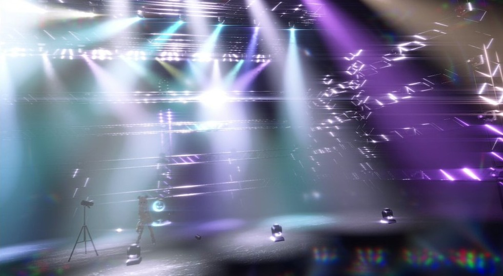

# Art-Net DMX Lighting for Unity

Unity上でArt-Net/DMXを受信し、Fixture単位でライト・Pan/Tilt・レンズ表現まで制御するシステムです。  
ライブ受信とTimeline再生の両方に対応しています。

## サンプルシーン

[](https://x.com/Oshino_Tech/status/2030463515891220541?s=20)

[](https://x.com/Oshino_Tech/status/2025485134578028589?s=20)

## このリポジトリでできること

- Art-Net DMX受信（Universe単位）
- Fixtureプロファイルに基づくDMX制御
- カラー（RGB）/Dimmer/Pan/Tiltの適用
- Built-in/URP向けとHDRP向けのLightDriver切替
- Timeline経由の再生（`ArtNetChannels` + `DmxTimelinePlayback`）
- DMX記録とAnimationClip書き出し（Recorder）
- Editor拡張によるPrefab置換・ライト複製・CSV書き出し

## 詳細ドキュメント

詳細は以下の Notion ページをご確認ください。

- [Art-Net DMX Lighting for Unity by Oshino](https://sleepy-smoke-ee3.notion.site/Art-Net-DMX-Lighting-for-Unity-by-Oshino-313d1c2c96f580be8e67eef37628ef5f?source=copy_link)

## プロジェクトの取得方法

このリポジトリには Git LFS 管理ファイル（`.unity` / `.fbx` など）が含まれます。  
`Download ZIP` では実体ではなくポインタファイルになる場合があるため、以下の手順で取得してください。

1. PowerShell を「通常権限」で開き、`winget` が使えるか確認します。

```powershell
winget --version
```

2. Git をインストールします。

```powershell
winget install --id Git.Git -e --source winget
```

3. Git LFS をインストールします。

```powershell
winget install --id GitHub.GitLFS -e --source winget
```

4. PowerShell を一度閉じて開き直し、インストール確認をします。

```powershell
git --version
git lfs version
```

5. 取得コマンドを実行します（`git lfs install` は最初の1回だけ）。

```powershell
git lfs install
git clone https://github.com/nao40031/Art-Net-DMX-Lighting-for-Unity.git
cd Art-Net-DMX-Lighting-for-Unity
git lfs pull
git lfs checkout
```

6. 取得したフォルダの場所は、次のコマンドを実行して確認します。

```powershell
Write-Host "取得完了フォルダ: $((Get-Location).Path)"
```

必要なら次を実行して、取得フォルダをエクスプローラーで開けます。

```powershell
explorer .
```

`git clone` は、PowerShellを開いている現在のフォルダ配下に作成されます。  
現在位置の確認は `pwd`、任意の保存先に移動する場合は `cd <保存先パス>` を先に実行してください。

```powershell
pwd
```

PowerShell のプロンプト（`PS C:\...\Art-Net-DMX-Lighting-for-Unity>`）に表示されるパスも、同じ取得先フォルダです。

7. Unity Hub で `Add` を押し、`Art-Net-DMX-Lighting-for-Unity` フォルダを選択して開きます。

`winget` が使えない場合は、Git と Git LFS を通常インストーラーで入れた後に手順 4 以降を実行してください。

### macOSで取得する場合

このリポジトリには Git LFS 管理ファイル（`.unity` / `.fbx` など）が含まれます。  
`Download ZIP` では実体ではなくポインタファイルになる場合があるため、以下の手順で取得してください。

1. Terminal で Git のバージョンを確認します。

```bash
git --version
```

もし以下のように「Developer tools が見つからない」と表示された場合は、Command Line Tools のインストールが必要です。

- `xcode-select: note: No developer tools were found, requesting install.`

その場合は、次を実行してインストールしてください。

```bash
xcode-select --install
```

インストール完了後、再度 Git が使えるか確認します。

```bash
git --version
```

2. 次に Git LFS を確認します。

```bash
git lfs version
```

もし次のように表示された場合、Git LFS はまだ未導入です。

- `git: 'lfs' is not a git command. See 'git --help'.`

未導入の場合は、次のステップで Git LFS をインストールします。

3. Git LFS の配布ページ（Releases または公式サイト）から **macOS 向けバイナリ**をダウンロードします。  
ダウンロード後、解凍（展開）すると `git-lfs-3.7.1` のようなフォルダができます（※バージョン番号は異なってOK）。

4. まず Downloads に移動し、展開されたフォルダに入ります。

```bash
cd ~/Downloads
cd git-lfs-3.7.1
ls
```

`install.sh` があることを確認したら実行します。

```bash
./install.sh
```

もし次のような権限エラーが出た場合は、`sudo` を付けて実行してください。

- `Error: Insufficient permissions to install in /usr/local. Try running with sudo or choose a different prefix.`

```bash
sudo ./install.sh
```

`sudo` 実行時にパスワード入力を求められますが、入力中は文字が表示されなくても正常です（そのまま入力して Enter）。

成功すると `Git LFS initialized.` のような表示が出ます。

5. インストール後、念のため Git LFS を初期化します（1回だけでOK）。

```bash
git lfs install
```

最後にバージョンが表示されることを確認します。

```bash
git lfs version
```

`git-lfs/3.x.x` のように表示されればインストール完了です。

Git LFS の導入後、以下の手順でリポジトリを取得してください。

```bash
cd ~
git clone https://github.com/nao40031/Art-Net-DMX-Lighting-for-Unity.git
cd Art-Net-DMX-Lighting-for-Unity
git lfs pull
git lfs checkout
git lfs ls-files
```

Finder でフォルダを開く場合：

```bash
open .
```


## クイックスタート（ライブ受信）

1. シーンに `ArtNetReceiver` を配置し、`host` と `port`（通常 `6454`）を設定します。
2. シーンに `DmxRigController` を配置し、`receiver` を割り当てます。
3. 制御対象オブジェクトに `DmxFixtureComponent` を追加します。
4. `DmxFixtureComponent` に `fixture`（`FixtureDefinition`）と `mode`、`universe`、`startAddress` を設定します。
5. `targetLight`/`targetLights`、必要に応じて `panTransform`/`tiltTransform` を設定します。
6. `DmxRigController` の `Discover & Initialize Fixtures` を実行します。
7. Art-Net送信側からDMXを送信して動作確認します。

## クイックスタート（Timeline再生）

1. `ArtNetChannels` を再生ソース用オブジェクトに追加し、`Ch1..Ch512` をAnimation/Timelineで駆動します。
2. `DmxTimelinePlayback` を配置し、`rig` に `DmxRigController` を割り当てます。
3. `sources` に `universe` + `ArtNetChannels` の組を追加します。
4. 必要に応じて `overrideRigInputMode` を有効化し、`PlaybackOnly` で再生します。

## レコーディング（DMXからClip化）

1. `ArtNetReceiverDmxRecorder`（`ArtNetDataRecorder.cs`）を配置し `receiver` を設定します。
2. `Start Recording` で録画開始、`Stop & Save` で停止保存します。
3. `Assets/<directoryPath>` に `ArtNetChannels` 向けAnimationClipが保存されます。

## License

- This project (scripts and Unity assets in this repository) is provided under the **MIT License**.
- Unity-chan-related assets use **Unity-chan License 3.0 (UCL 3.0)**.

### Unity-chan License 3.0 documents
- `Assets/Avatar/Unity-chan/License/EN_Unity-Chan License Terms and Condition_UCL3.0.pdf`
- `Assets/Avatar/Unity-chan/License/JP_Unity-Chan License Terms and Condition_UCL3.0.pdf`
- `Assets/Avatar/Unity-chan/License/License Logo/` (logo usage/identity guidance)
